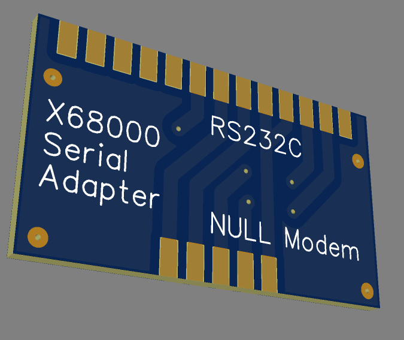

# x68k-serial-adapter

An RS-232c (DB25) to null modem cable (DB9) Adapter for the [X68000](https://en.wikipedia.org/wiki/X68000).

## Hardware

I originally made this with EasyEDA, the project can be found [here](https://easyeda.com/cpld/x68k-rs232c-adapter).

This is a KiCAD PCB only export of the EasyEDA project.

Parts needed are only a male DB25 and a female DB9 solder typ connector that connect to the edge of the PCB.

[Prototype Top](img/proto-1.0-top.jpeg)

[Prototype Bottom](img/proto-1.0-bottom.jpeg)

## Acknowledgments

Made possible by the awesome NFGGames X68000 Special Interest Group.

- [NFG / GameSX Wiki](https://gamesx.com/wiki/doku.php?id=x68000:rs232_null_modem_cable_with_partial_handshaking)